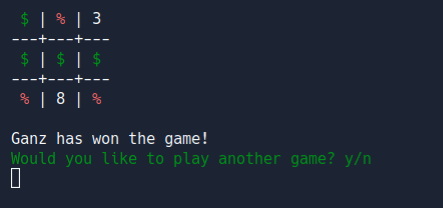

## This program is a game of tictactoe that you run from your command line.
---

If you don't want to save the repo locally and run from there, you can play it at [here at Replit](https://replit.com/@Lollganz/oop-tictactoe) and either:
- Run the program using the green **run** button.
- Or run the program using the command `ruby main.rb`